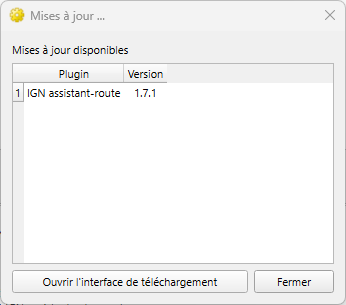
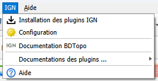
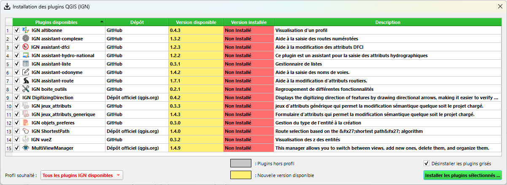
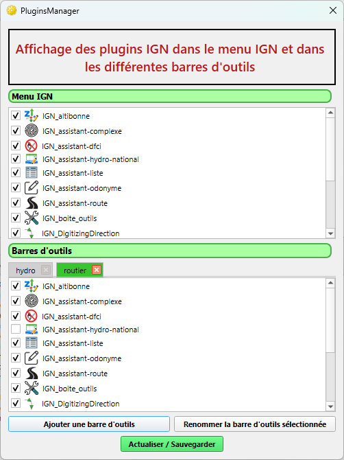

<table>
<colgroup>
<col style="width: 21%" />
<col style="width: 78%" />
</colgroup>
<tbody>
<tr>
<td rowspan="2"></td>
<td style="text-align: center;font-size: 24px;"><strong>PluginsManager
v2.0.0</strong></td>
</tr>
<tr>
<td style="font-size: 16px;text-align: center;">Développeur  : Gérôme PECHEUR (IGN)</td>
</tr>
</tbody>
</table>
  

## Sommaire

- [1. Prérequis](#prerequis)
- [2. Résumé](#resume)
- [3. Installation](#installation)
- [4. Présentation](#presentation)

  <h2 id="prerequis" style="color: white;margin:0;" >1. Prérequis</h2>

Version de QGIS : version supérieure à 3.28
Cette version est compatible QGIS 4

  <h2 id="resume" style="color: white;margin:0;" >2. Résumé</h2>

Ce plugin permet :
* De télécharger les plugins IGN (préfixés par « IGN_ ») depuis le dépôt officiel QGIS lorsqu’ils y sont disponibles, ou depuis le dépôt GitHub dans le cas contraire. 
* De configurer l'interface (intégration des différents plugins IGN dans un menus IGN et / ou dans des barres d'outils.  
* D'ouvrir les documentations des plugins IGN, de vérifier les mises à jour disponibles des plugins pris en compte
* De notifier si des mises à jour sont disponibles et de proposer de les installer si nécessaire.

  <h2 id="installation" style="color: white;margin:0;" >3. Installation</h2>

Ce plugin s’installe via le dépôt officiel.  
Dans QGIS , allez dans le menu "Extensions" -> "Installer/Gérer les extensions".  
Recherchez "IGN PluginsManager".  
Cliquez sur "Installer l'extension"  

  <h2 id="présentation" style="color: white;margin:0;" >4. Présentation</h2>

Lors de l’ouverture d’un projet QGIS, le plugin maître détecte automatiquement si des mises à jour sont disponibles pour les plugins IGN.  
Si des mises à jour sont disponibles, une fenêtre de notification apparaît à l’ouverture de QGIS.

Ce plugin ajoute un menu IGN dans la barre des menus de QGIS.   

* Installation des plugins IGN

Cette interface recense tous les plugins IGN disponibles dans le dépôt officiel QGIS ou dans le dépôt Github, et permet leur installation en fonction du profil souhaité
 
* Configuration : Permet de configurer l’interface (intégration des différents plugins IGN dans les menus et / ou dans des barres d’outils).  

	Ici il est possible de choisir les plugins à intégrer dans le menu IGN et / ou dans des barres d’outils.  
Les plugins préfixés "IGN_" sont détectés automatiquement.  

- Documentation BDTopo : adffiche la documentation de la BDTopo (https://bdtopoexplorer.ign.fr/)
- Documentation des plugins : affiche la documentation de tous les plugins IGN disponibles dans l'installation.
- La liste des plugins IGN ajoutés dans le menu
- Aide : documentation et suivi des versions

